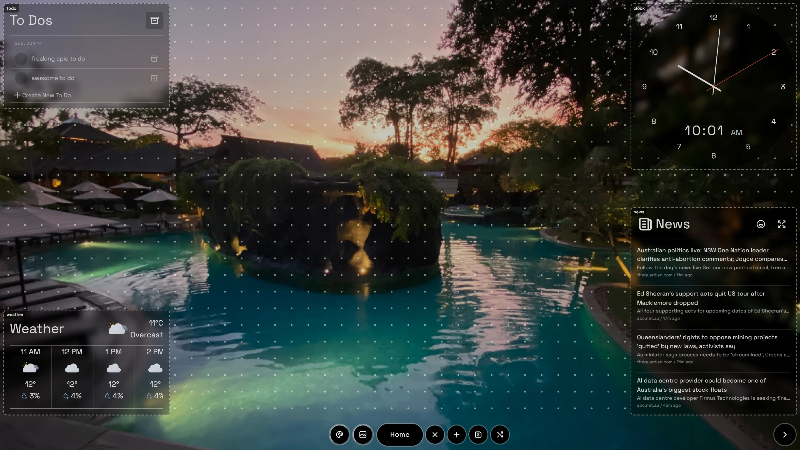
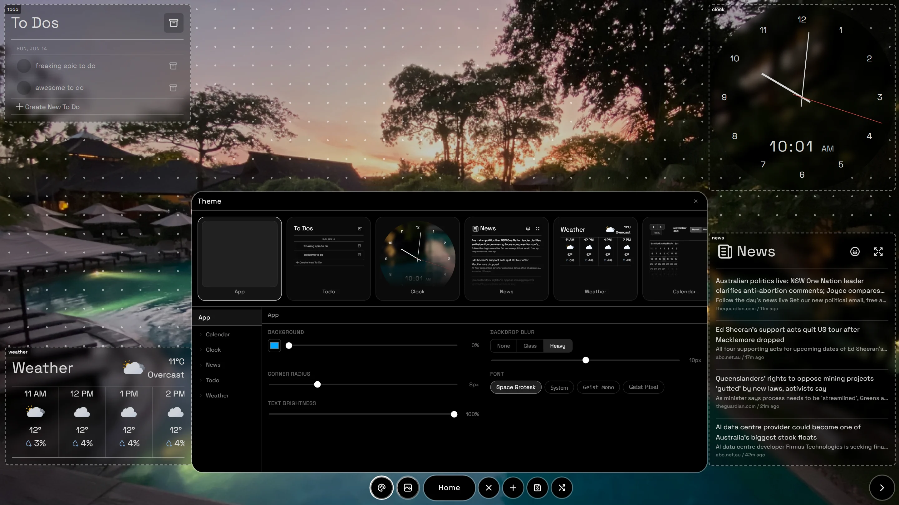

*Your space is sacred. A billboard doesn't belong there.*

MattBoard is a smart display for a wall. A cheap computer — a Raspberry Pi is
the target — sits behind a screen, boots into a browser, and shows a clock, a
to-do list, the weather, news headlines and a slow slideshow of your own
photos. The commercial versions of this want an account, a monthly fee, and
space on your kitchen wall for their branding. This one runs on hardware you
already own, keeps everything in plain files on that machine, and is licensed
AGPL so that anyone who runs it as a service has to publish their changes too.

## Three repositories

**MattBoard** is the board itself: React, Vite, and the builder you arrange it
with. **MattBoard-backend** is a small Express server on the same machine that
holds the layout, the to-do list, and every credential — no key ever reaches
the browser. **MattBoard-hosted** is the other answer to the same problem: a
multi-tenant version with accounts and a database, built as a wrapper that
never edits a line of the open-source halves. The third one is where the
licence stops being a footnote and starts being architecture, so it gets its
own section below.

## A layout is a list of anchors

A board is pages; a page is widgets; a widget knows its size and where it is
pinned. Crucially it is pinned to the nearest *corner* as a percentage rather
than placed at a pixel — the editor picks whichever edge is closer on each axis
and stores the offset from there. That is the whole reason a board arranged on
a laptop lands correctly on the 1080p panel it will actually live on, and why
the same layout survives being turned portrait.

Dragging is hand-written pointer-event code rather than a library, for a reason
that shows up immediately on a touchscreen: during a drag nothing re-renders.
The widget's transform is written directly to the element inside an animation
frame, the blue snap guides are raw DOM nodes appended and removed, and React
only hears about any of it on release. Edges and centres snap within 30 pixels,
and the board keeps a 10-pixel margin so nothing can be dragged off its own
screen.

Builder mode is a draft. Entering it deep-clones the pages, the theme and the
background; leaving it throws the clone away. The close button diffs the draft
against what is saved and only asks for confirmation if something really
changed — and it normalises both sides before comparing, because the
normaliser upgrades older layout shapes and would otherwise report a legacy
field as an edit you never made.

## Widgets are folders

Every widget is a directory containing a five-line manifest, a component and a
settings schema, and the registry is built by globbing for exactly those three
files at build time. Adding a widget is adding a folder; nothing central has to
learn about it.

Two error boundaries guard the result, and both exist because of where this
runs. The outer one prints the raw stack on a black screen, since a wall
display has no console to open. The inner one wraps each widget individually,
so a news feed that throws becomes a small red box saying *news crashed* rather
than a blank wall.

## The glass is a lie

The frosted panels behind each widget are not live blur. Running
`backdrop-filter` over a full-screen photo on every frame is precisely the work
a Raspberry Pi cannot spare. So the server blurs the wallpaper once — `sharp`,
one pass, cached for half an hour — and every widget paints that blurred copy
as its own background, offset by its position on screen.

Getting it to line up is the fiddly part, because the real photo is displayed
with `background-size: cover`, so the browser is cropping and scaling it in a
way nothing else knows about. The hook recomputes that same letterboxing maths,
works out where the widget sits inside the scaled image, and offsets the blurred
copy to match. The effect is glass; the cost is one image fetch and no per-frame
work at all. Round clock faces opt out of the wrapper and apply it to the face
itself, or the illusion breaks at the corners.

Live `backdrop-filter` is still there as a setting, for machines that can spare
it.

## Everything with a key lives on the server

The board talks only to `localhost`. Each integration behind that boundary has
its own character:

- **iCloud shared albums** have no public API, so this is a polite piece of
  reverse engineering: post to the shared-stream endpoint, notice that iCloud
  replies with the name of the host you should actually have asked, re-issue
  the whole request against that host, then resolve each photo's real URL in a
  second call and take the largest derivative. A shuffle that re-rolls when it
  draws the photo already on screen means the wall never repeats itself twice
  in a row.
- **NASA's image library** needs no key at all, which is the reason it is
  offered as a second backdrop source. Full-resolution URLs are not in the
  response; they are obtained by rewriting `~thumb.jpg` to `~orig.jpg`, because
  the library has no field for them.
- **Weather** is Open-Meteo, sliced to the next 24 hours by matching the
  current hour against the hourly series — and returning nothing rather than
  something wrong if that match fails.
- **News** is RSS plus AFINN sentiment scoring, mapped through `tanh` so that
  an unbounded comparative score becomes a 0-to-1 number with neutral at 0.5.
  The widget then filters at 0.5 by default. "Good news mode" is, honestly,
  just *headlines that are not negative* — the score only ever sees the title.

Storage is three JSON files. There is no database and no auth, because on a
private network behind your own front door there is nothing to authenticate.

## The Pi is a design constraint, not a deployment target

The performance work is visible in the commit history and all of it is about
one machine. Offscreen pages are frozen rather than unmounted, so switching
pages costs a transform and not a remount. The weather icon set was vendored
locally after it turned out to be a network request per icon. There is a branch
whose only difference is that it disables blur, which is what the display ran
on before the prerendered version existed. And there was a two-commit
experiment swapping React for Preact, reverted the same day with the verdict
that it "didn't seem to do much".

## The hosted version is the licence, expressed as architecture

MattBoard-hosted is the commercial answer, and the AGPL is what shaped it. The
two open repositories are pulled in as git submodules and are never edited. The
proprietary layer attaches in exactly three places:

1. **Composition.** The hosted entry point wraps the core `App` in auth,
   permissions and onboarding gates without touching it.
2. **Four swapped files.** A Vite plugin intercepts imports at resolution time
   and substitutes hosted implementations for four core modules — the API base,
   the widget registry, the calendar auth hook, and a user button that the open
   core deliberately ships as a component returning `null`.
3. **One monkey patch.** The hosted front end wraps `window.fetch` and attaches
   a Supabase bearer token to any request aimed at the API, which is how
   unmodified core code becomes authenticated code.

Behind it, every JSON file becomes a Postgres table with row-level security,
the single global Google token becomes one row per user — the user's id is
carried through the OAuth round trip in the `state` parameter — and widget
availability becomes a permissions table that the registry enforces by deleting
entries it is not allowed to show.

One route has to stay public, and the comment in the source says why: the blur
endpoint is loaded as a CSS background image, which bypasses the fetch shim
entirely and therefore carries no authorization header. That is an open image
proxy, taken knowingly.

The parts I enjoyed most are the ones a self-hosted board never needs. Signing
up is a typewriter conversation rather than a form, with a slower delay when it
backs up a step and escalating prompts if you keep failing your own password
(*"Want a hint? Me too."*). And the signed-out landing page is a real board:
the actual widget components, rendered against a query cache pre-seeded with
dummy data so nothing hits the network, draggable, with a hint that disappears
the first time you move something.

## Where it stands

The clock, to-do list, photo backdrop, news and weather all work. The builder
and the theme system are the most finished parts of the project.

The calendar is the outstanding failure, and it is a good lesson in error
handling. Google OAuth genuinely works — the consent round trip completes and a
valid refresh token is on disk. But the events route catches every possible
error and collapses it into a bare 502, without logging the cause; and the
client only recognises a 401 as "not connected". So a failure renders as a
perfectly drawn, permanently empty month grid, with nothing in the server log
to explain it. The bug is not that the request fails. The bug is that three
different causes were made indistinguishable.

There is a smaller one of the same family: the bundled default layout writes
the weather widget's coordinates under the wrong key, so a fresh install shows
"not set up" instead of a forecast — and the coordinates it writes are the
northern-hemisphere mirror of Melbourne.

The hosted version runs end to end against a local Supabase instance — sign up,
get a board, arrange it, connect a calendar, delete your account — but it has
never been deployed; every URL in its config still points at `127.0.0.1`. All
three repositories stopped within ten days of each other in mid-2026, on the
line the author wrote himself: *will finalise web hosting stack and hook up
soon*.
